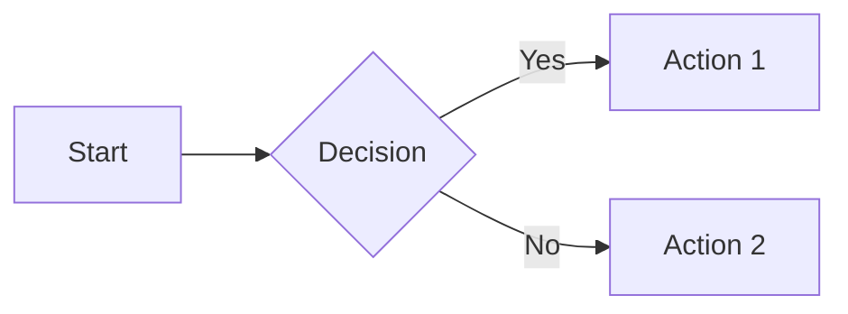

# Advanced Features

Advanced features and edge cases.

## Nested Navigation

You're currently in: Features > Advanced

Navigate to:
- [Back to Features Overview](overview.md)
- [Up to Home](../index.md)
- [Jump to API](../api.md)

## Complex Code Blocks

````python
def nested_example():
    """Example with nested code."""
    code = '''
    def inner():
        return "nested"
    '''
    return code
````

## Multiple Admonitions

!!! warning "Important"
    Pay attention to this warning!

!!! success "Great!"
    Everything works as expected.

!!! failure "Error"
    Something went wrong.

!!! info "Information"
    Just so you know...

## Mermaid-style Fence (if supported)



## Mathematical Expressions

Inline math: $E = mc^2$

Block math:

$$
\int_{-\infty}^{\infty} e^{-x^2} dx = \sqrt{\pi}
$$
